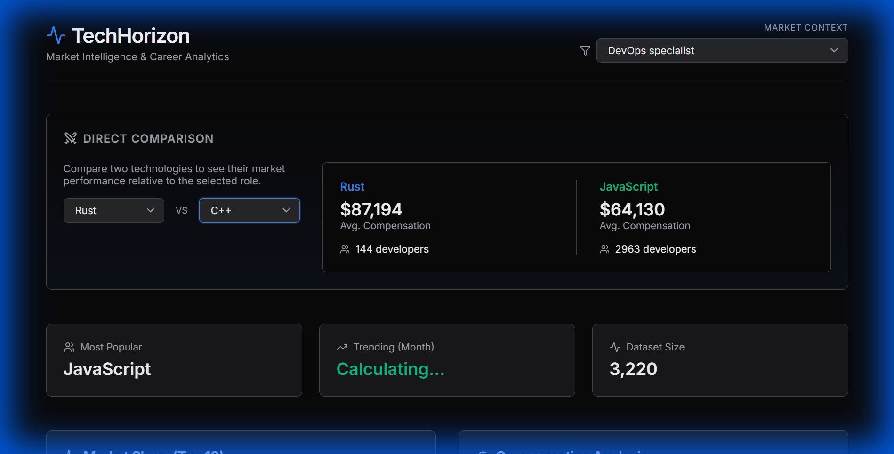

# TechHorizon

A career intelligence tool that helps developers understand the tech job market using real survey data.



## What does it do?

TechHorizon analyzes data from thousands of developer surveys to answer questions like:
- Which programming languages are most popular right now?
- What skills pay the best salaries?
- Which technologies are growing fastest?

You can filter everything by job role (like "Data Scientist" or "Full Stack Developer") to get personalized insights.

## Features

**Tech Comparison** - Compare two programming languages side-by-side to see which one has higher salaries and more users.

**Market Overview** - See the top 10 most-used technologies in your field.

**Salary Analysis** - Find out which skills earn the most money.

**Growth Tracker** - Discover which technologies are trending upward.

## How to run it

### Backend (Python)
```bash
cd backend
pip install -r requirements.txt
python -m uvicorn main:app --reload
```

The API will start at `http://localhost:8000`

### Frontend (React)
```bash
cd frontend
npm install
npm run dev
```

The website will open at `http://localhost:5173`

## Data Sources

This project uses:
- Stack Overflow Developer Survey (2023 & 2024)
- Kaggle Tech Salary Dataset

The large CSV files are not included in this repo. You can download them from the links in `data/README.md`.

## Built with

- **Frontend**: React, Recharts
- **Backend**: Python, FastAPI, Pandas
- **Design**: Custom CSS (no frameworks)

## Why I built this

I wanted to create something that combines data analysis with practical career planning. Instead of just showing charts, TechHorizon lets you explore the data yourself and find insights relevant to your career path.

